## class Diagram
The class diagram is the main building block of object-oriented modeling. It is used for general conceptual modeling of the structure of the application, and for detailed modeling translating the models into programming code. Class diagrams can also be used for data modeling. The classes in a class diagram represent both the main elements, interactions in the application, and the classes to be programmed.

Mermaid can render class diagrams.
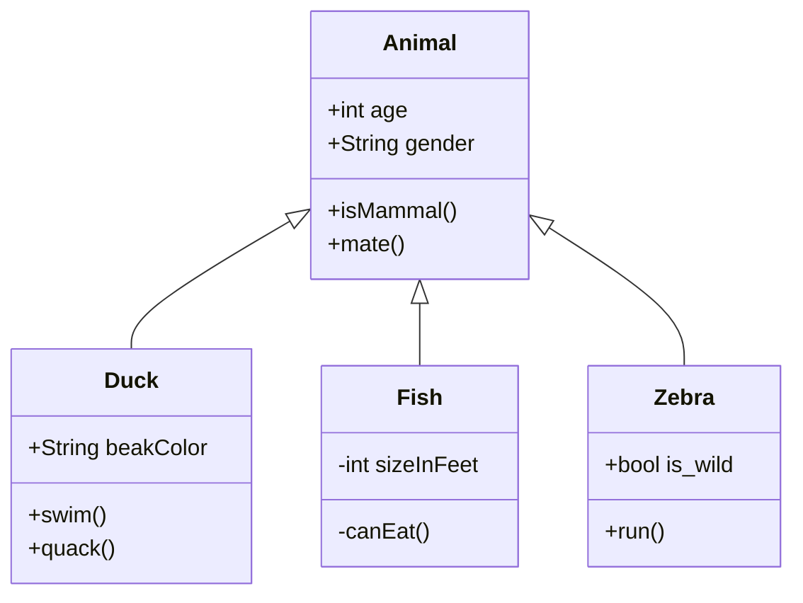
## class
UML provides mechanisms to represent class members, such as attributes and methods, and additional information about them. A single instance of a class in the diagram contains three compartments:

    The top compartment contains the name of the class. It is printed in bold and centered, and the first letter is capitalized. It may also contain optional annotation text describing the nature of the class.
    The middle compartment contains the attributes of the class. They are left-aligned and the first letter is lowercase.
    The bottom compartment contains the operations the class can execute. They are also left-aligned and the first letter is lowercase.
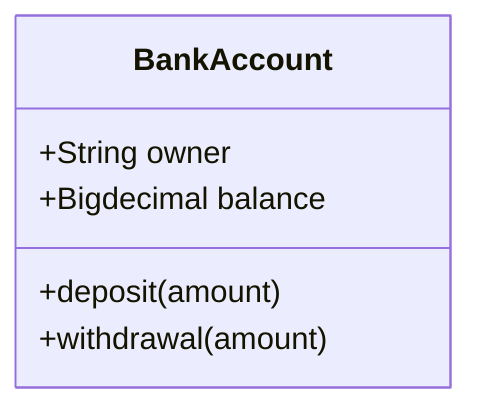

## Define a class

There are two ways to define a class:

- Explicitly defining a class using keyword class like class Animal. This defines the Animal class
- Define two classes via a relationship between them Vehicle <|-- Car. This defines two classes Vehicle and Car along with their relationship.

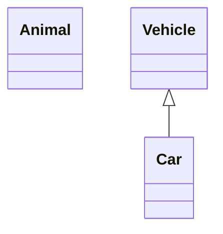

## Defining Members of a class

UML provides mechanisms to represent class members, such as attributes and methods, and additional information about them.

Mermaid distinguishes between attributes and functions/methods based on if the parenthesis () are present or not. The ones with () are treated as functions/methods, and others as attributes.

There are two ways to define the members of a class, and regardless of whichever syntax is used to define the members, the output will still be same. The two different ways are :

 - Associate a member of a class using : (colon) followed by member name, useful to define one member at a time. For example:

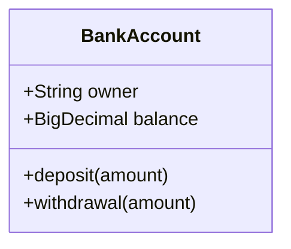
- Associate members of a class using {} brackets, where members are grouped within curly brackets. Suitable for defining multiple members at once. For example:

## Return Type
Optionally you can end the method/function definition with the data type that will be returned (note: there must be a space between the final ) of the method definition and return type example:

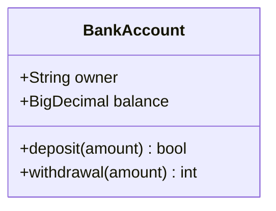
## Generic Types

Members can be defined using generic types, such as **List<int>**, for fields, parameters and return types by enclosing the type within ~ (tilde). Note: nested type declarations (such as **List<List<int>>**) are not currently supported

This can be done as part of either class definition method:
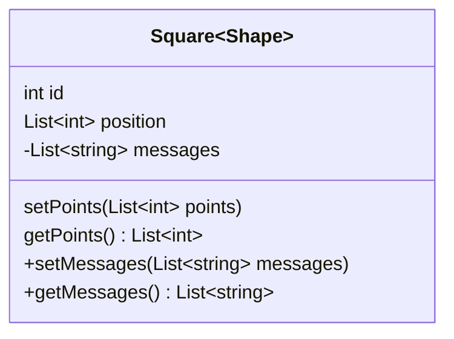
## Return Type

Optionally you can end the method/function definition with the data type that will be returned
## Visibility

To specify the visibility of a class member (i.e. any attribute or method), these notations may be placed before the member's name, but it is optional:

-   + Public
-   - Private
-   # Protected
-   ~ Package/Internal

note you can also include additional classifiers to a method definition by adding the following notations to the end of the method, i.e.: after the ():

-  * Abstract e.g.: someAbstractMethod()*
-  $ Static e.g.: someStaticMethod()

note you can also include additional classifiers to a field definition by adding the following notations to the end of the field name:

-  $ Static e.g.: String someField

## Defining Relationship

A relationship is a general term covering the specific types of logical connections found on class and object diagrams.

Type|Description
--|:--:|
<|-- |	Inheritance
*-- |	Composition
o-- |	Aggregation
--> |	Association
-- 	 |   Link (Solid)
..> |	Dependency
..|> |	Realization
.. 	 |   Link (Dashed)

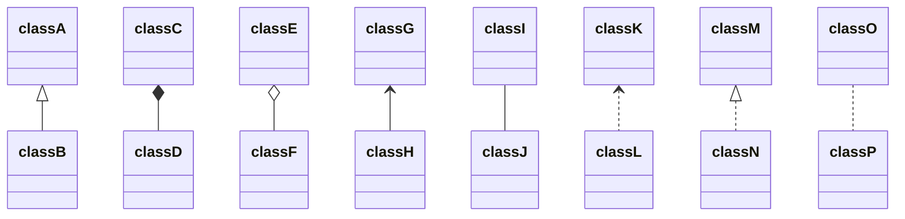

We can use the labels to describe nature of relation between two classes. Also, arrowheads can be used in opposite directions as well :

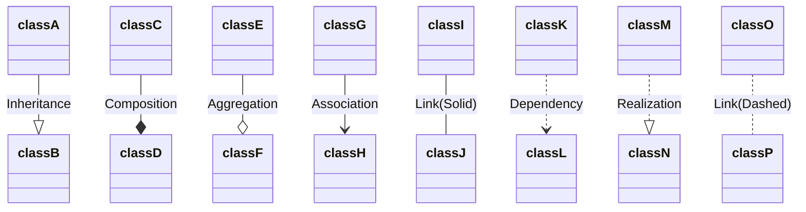
##Labels on Relations

It is possible to add a label text to a relation:

 - [classA][Arrow][ClassB]:LabelText
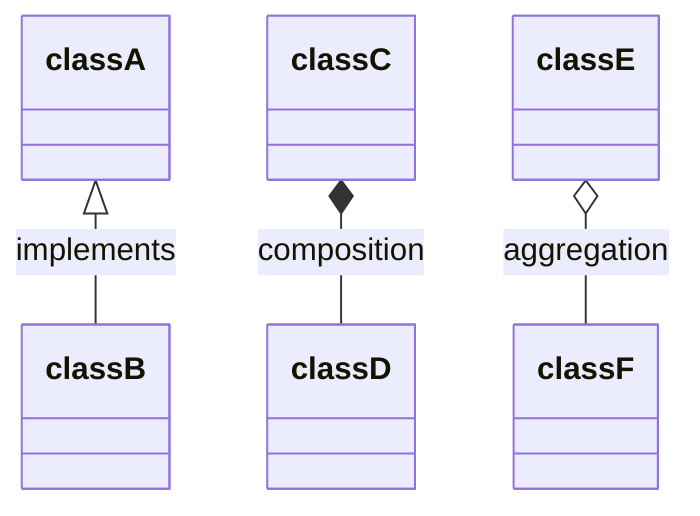
## Two-way relations

Relations can go in multiple ways:
Where Relation Type can be one of:
Type|Description
--|:--:|
<\| |Inheritance
* | Composition
o 	|Aggregation
> 	|Association
< 	|Association
|> 	|Realization

And  Link  can be one of:
Type|Description
--|:--:|
-- |	Solid
.. |	Dashed

Cardinality / Multiplicity on relations

Multiplicity or cardinality in class diagrams indicates the number of instances of one class linked to one instance of the other class. For example, one company will have one or more employees, but each employee works for just one company.

Multiplicity notations are placed near the ends of an association.

The different cardinality options are :

- 1 Only 1
- 0..1 Zero or One
- 1..* One or more
- \* Many
- n n {where n>1}
- 0..n zero to n {where n>1}
- 1..n one to n {where n>1}
Cardinality can be easily defined by placing cardinality text within quotes " before(optional) and after(optional) a given arrow.
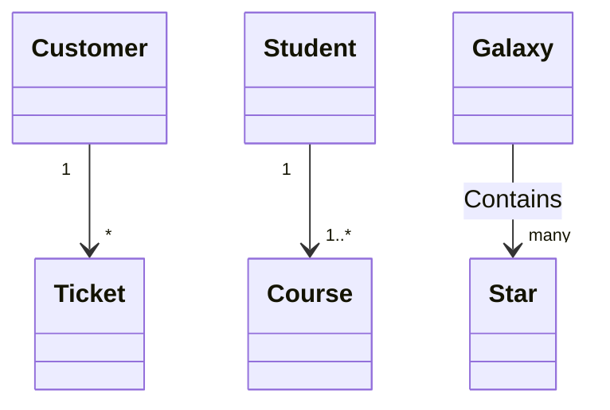

## Annotations on classes

It is possible to annotate classes with a specific marker text which is like meta-data for the class, giving a clear indication about its nature. Some common annotations examples could be:

- \<\<Interface\>\> To represent an Interface class
- \<\<abstract\>\> To represent an abstract class
- \<\<Service\>\> To represent a service class
- \<\<enumeration\>\> To represent an enum

Annotations are defined within the opening << and closing >>. There are two ways to add an annotation to a class and regardless of the syntax used output will be same. The two ways are :

- In a ***separate line*** after a class is defined. For example:
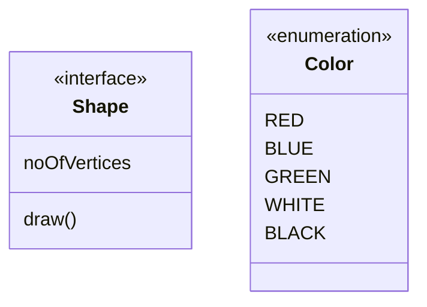

## Comments

Comments can be entered within a class diagram, which will be ignored by the parser. Comments need to be on their own line, and must be prefaced with %% (double percent signs). Any text after the start of the comment to the next newline will be treated as a comment, including any class diagram syntax
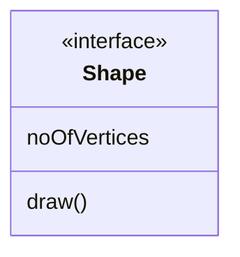
## Setting the direction of the diagram

With class diagrams you can use the direction statement to set the direction which the diagram will render like in this example.
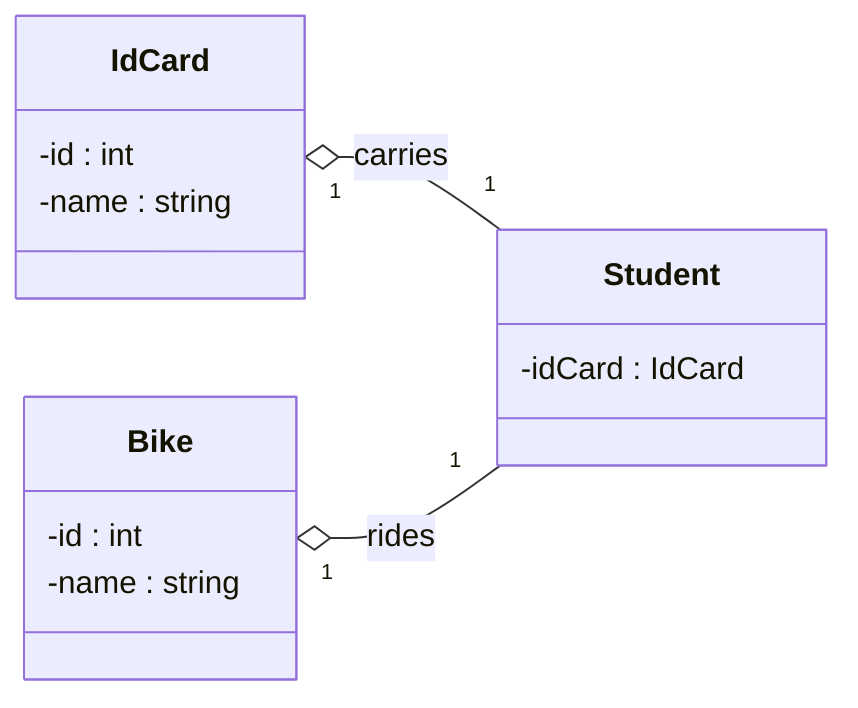

