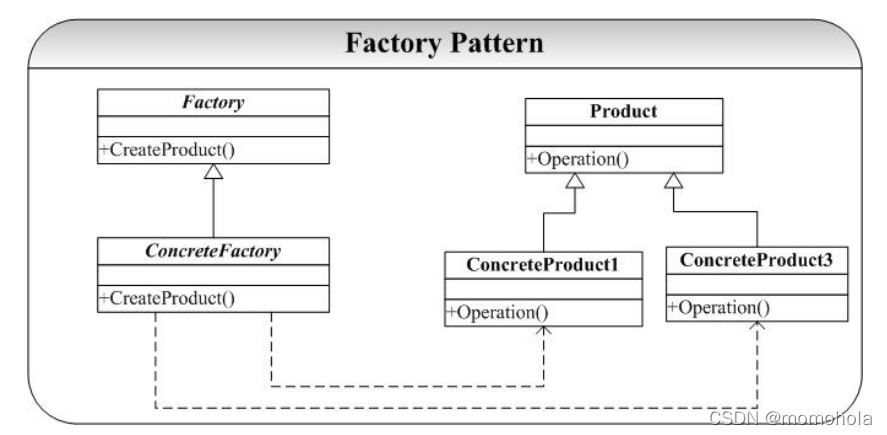

<!--
 * @Author: Jacky
 * @Date: 2022-09-02 10:02:39
 * @LastEditors: Jacky
 * @LastEditTime: 2022-09-02 17:11:47
 * @FilePath: \StudyNote\学习笔记\编程语言\C++\设计模式\C++设计模式.md
-->
## 创造型模式

### 单例模式
~~~C++
class Singleton{
public:
    static Singleton *getInstance();
private:
    Singleton(){}
}

Singleton *Singleton::getInstance()
{
    static Singleton singleton;
    return &singleton;
}
~~~

### 工厂模式

