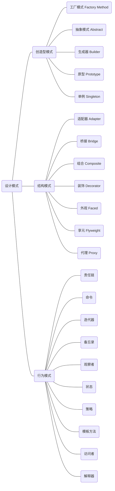

<!--
 * @Author: Jacky
 * @Date: 2022-09-02 10:00:03
 * @LastEditors: Jacky
 * @LastEditTime: 2022-09-05 10:03:42
 * @FilePath: \StudyNote\学习笔记\编程语言\C++\设计模式\设计模式原则.md
-->
# 设计模式原则

## 1、开闭原则（Open Close Principle）

开闭原则就是说对扩展开放，对修改关闭。在程序需要进行拓展的时候，不能去修改原有的代码，实现一个热插拔的效果。所以一句话概括就是：为了使程序的扩展性好，易于维护和升级。想要达到这样的效果，我们需要使用接口和抽象类，后面的具体设计中我们会提到这点。

## 2、里氏代换原则（Liskov Substitution Principle）

里氏代换原则(Liskov Substitution Principle LSP)面向对象设计的基本原则之一。 里氏代换原则中说，任何基类可以出现的地方，子类一定可以出现。 LSP是继承复用的基石，只有当衍生类可以替换掉基类，软件单位的功能不受到影响时，基类才能真正被复用，而衍生类也能够在基类的基础上增加新的行为。里氏代换原则是对“开-闭”原则的补充。实现“开-闭”原则的关键步骤就是抽象化。而基类与子类的继承关系就是抽象化的具体实现，所以里氏代换原则是对实现抽象化的具体步骤的规范。—— From Baidu 百科

## 3、依赖倒转原则（Dependence Inversion Principle）

这个是开闭原则的基础，具体内容：是对接口编程，依赖于抽象而不依赖于具体。

## 4、接口隔离原则（Interface Segregation Principle）

这个原则的意思是：使用多个隔离的接口，比使用单个接口要好。还是一个降低类之间的耦合度的意思，从这儿我们看出，其实设计模式就是一个软件的设计思想，从大型软件架构出发，为了升级和维护方便。所以上文中多次出现：降低依赖，降低耦合。

## 5、迪米特法则（最少知道原则）（Demeter Principle）

为什么叫最少知道原则，就是说：一个实体应当尽量少的与其他实体之间发生相互作用，使得系统功能模块相对独立。

## 6、合成复用原则（Composite Reuse Principle）

原则是尽量使用合成/聚合的方式，而不是使用继承。

# python 设计模式

<table>
	<tr>
	    <th>类型</th>
	    <th>设计模式</th>  
        <th>描述</th>
	</tr >
	<tr >
	    <td rowspan="5">创建型</td>
        <td>Factory 模式</td>
        <td>产品对象家族</td>
	</tr>
	<tr>
	    <td>AbstactFactory 模式</td>
	    <td>针对一个类的唯一实例</td>
	</tr>
	<tr>
	    <td>Singleton 模式</td>
	    <td>ES索引创建的操作</td>
	</tr>1
	<tr>
	    <td >Builder 模式</td>
	    <td>如何创建一个组合对象</td>
	</tr>
	<tr>
	    <td >Prototype 模式</td>
	    <td >针对被实例化的类</td>
	</tr>
  <tr>
	    <td rowspan="7">结构型</td>
	    <td >Bridge 模式</td>
        <td >对象的实现</td>
	</tr>
  <tr>
	    <td >Adapter 模式</td>
        <td >针对对象的接口</td>
	</tr>
  <tr>
	    <td >Decorator 模式</td>
        <td >对对象的职责，不生成子类</td>
	</tr>
  <tr>
	    <td >Composite 模式</td>
        <td >一个对象的结构和组成</td>
	</tr>
  <tr>
	    <td >Flyweight 模式</td>
        <td >对象的存储开销</td>
	</tr>
  <tr>
	    <td >Facade 模式</td>
        <td >对象的存储开销</td>
	</tr>
  <tr>
	    <td >Proxy 模式</td>
        <td >如何访问一个对象,该对象的位置</td>
	</tr>
  <tr>
	    <td rowspan="11">行为型</td>
	    <td >Template 模式</td>
     <td >对算法中的某些步骤</td>
	</tr>
    <tr>
	    <td >Strategy 模式</td>
     <td >策略算法</td>
	</tr>
    <tr>
	    <td >State 模式</td>
     <td >对象的状态</td>
	</tr>
    <tr>
	    <td >Observer 模式</td>
     <td >对多个对象依赖于另外一个对象，而这些对象又如何保持一致</td>
	</tr>
    <tr>
	    <td >Memento 模式</td>
     <td >对一个对象中哪些私有信息存放在该对象之外，以及在对什么时候进行存储</td>
	</tr>
    <tr>
	    <td >Mediator 模式</td>
     <td >对象间怎样交互、和谁交互</td>
	</tr>
     <tr>
	    <td >Command 模式</td>
     <td >何时、怎样满足一个请求</td>
	</tr>
    <tr>
	    <td >Visitor 模式</td>
     <td >某些可作用于一个（组）对象上的操作，但不修改这些对象的类</td>
	</tr>
    <tr>
	    <td >Chain of Responsibility 模式</td>
     <td >满足一个请求的对象链</td>
	</tr>    <tr>
	    <td >Iterator 模式</td>
     <td >如何遍历、访问一个聚合的各元素</td>
	</tr>
	</tr>    <tr>
	    <td >Interpreter 模式</td>
     <td >对一个语言的文法及解释</td>
	</tr>

