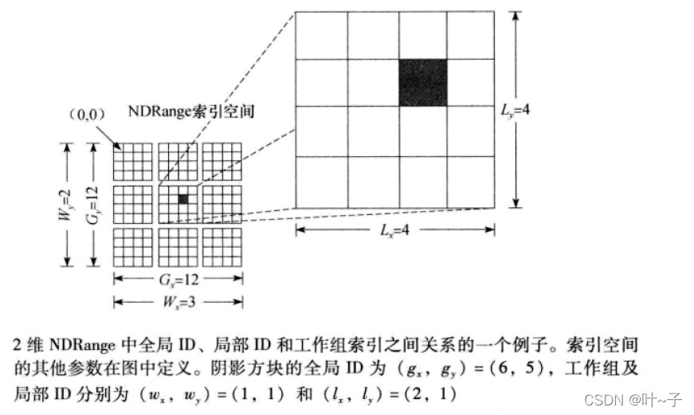

<!--
 * @Author: Jacky
 * @Date: 2022-05-30 15:49:09
 * @LastEditors: Jacky
 * @LastEditTime: 2022-05-31 14:26:05
 * @FilePath: \StudyNote\学习笔记\编程语言\openCL\学习笔记.md
-->

# openCL

## 一、什么是OpenCL
OpenCL是面向由CPU、GPU和其他处理器组合构成的计算机进行编程的行业标准框架。用OpenCL， 可以编写一款能够在各类系统上成功运行的程序，这些系统包括移动电话、笔记本电脑， 甚至是大规模超计算机中的节点。OpenCL通过公布硬件来提供高度的可移植性， 而不是将硬件隐藏在精巧的抽象之下。这说明OpenCL程序员必须显式地定义平台、 上下文， 以及在不同设备上调度工作。
OpenCL支持大量不同类型的应用。 笼统概括这些应用是很困难的。 不过， 不论哪一种情况， 面向异构平台的应用都必须完成以下步骤：

 - 发现构成异构系统的组件。
 - 探查这些组件的特征， 使软件能够适应不同硬件单元的特定特性。
 - 建将在平台上运行的指令块（内核）。
 - 建立并管理计算中涉及的内存对象。
 - 在系统中正确的组件上按正确的顺序执行内核。
 - 收集最终结果。

这些步骤通过OpenCL中的一系列API再加上一个面向内核的编程环境来完成。 采取分而治之的策略解释以上所有步骤的工作，分成以下模型：

 - 平台模型（platform model）：异构系统的高层描述。
 - 执行模型（execution model）：指令流在异构平台上执行的抽象表示。
 - 内存模型（memory model) : Open CL中的内存区域集合以及一个OpenCL计算期间这些内存区域如何交互。
 - 编程模型（programming model）：程序员设计算，法来实现一个应用时使用的高层抽象。

上下文资源：
- 设备（device）：宿主机使用的 OpenCL 设备集合。
- 内核（kernel）：在 OpenCL 设备上运行的 OpenCL函数。
- 程序对象（program object）：实现内核的程序源代码和可执行文件。
- 内存对象（memory object）：内存中对 OpenCL 设备可见的一组对象， 包含可以由内核实例处理的值。

openCL 的索引空间：

## 错误分析

### 1、clFlush clFinish
clFlush 将命令队列中的命令写入设备，不保证命令执行完成
clFinish 等待命令队列中的所以命令执行完成

对于数据在多个命令中使用的情况，需要调用clFinish保障前一个命令执行完成后，再执行下一个。否则会提示数据映射错误。